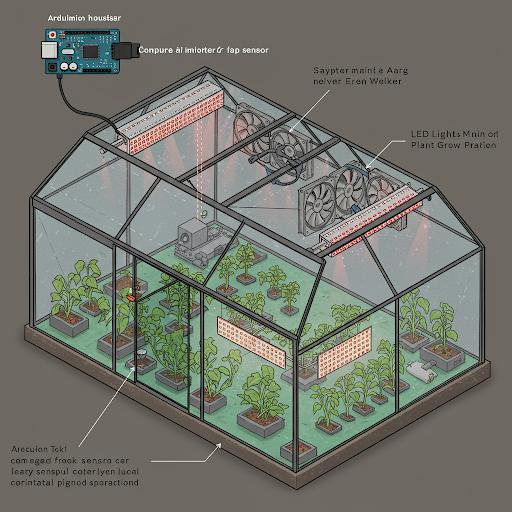
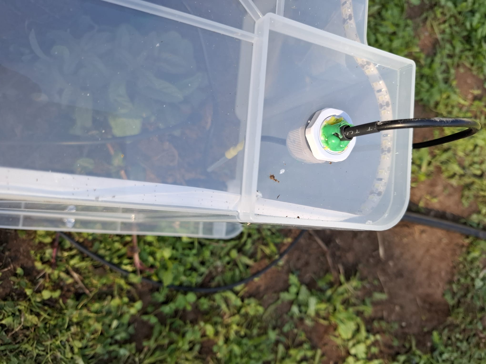
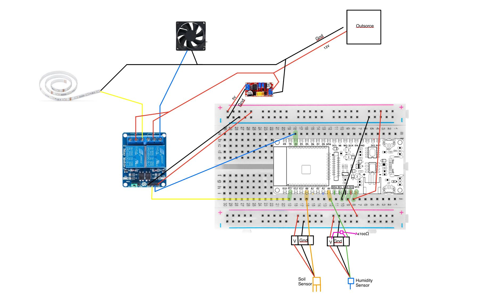
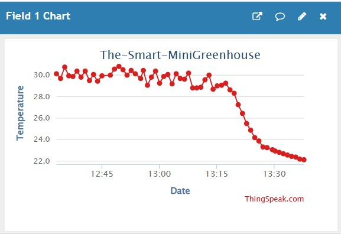
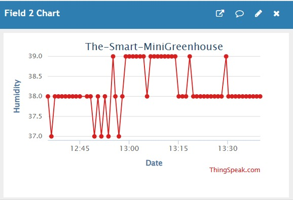
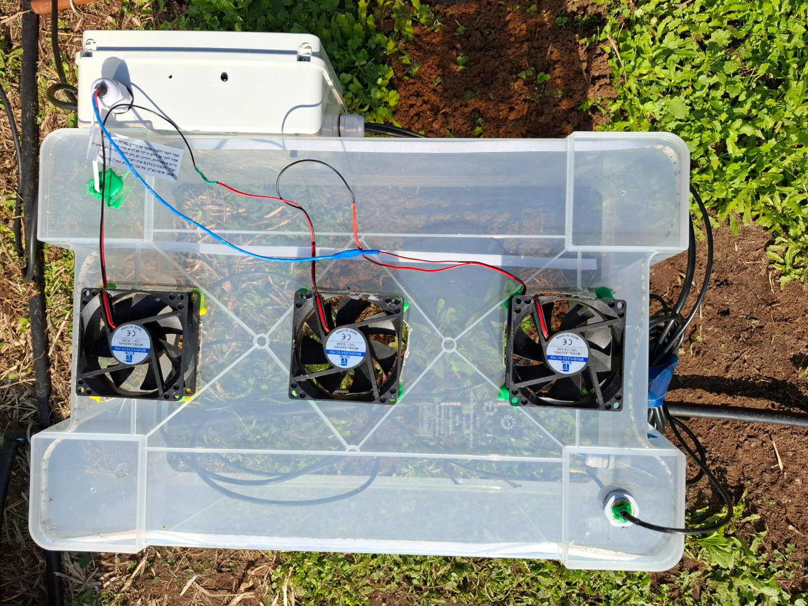
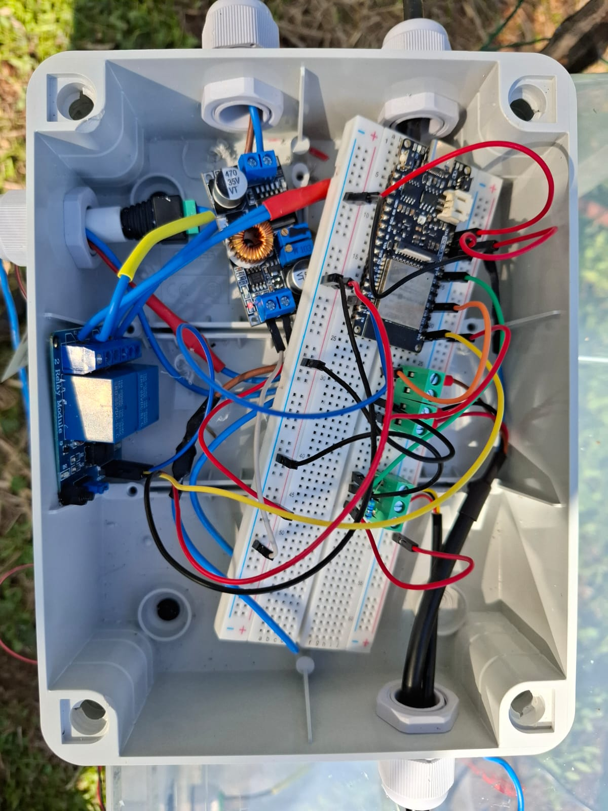
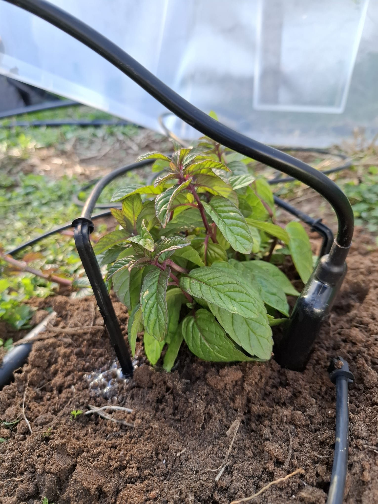
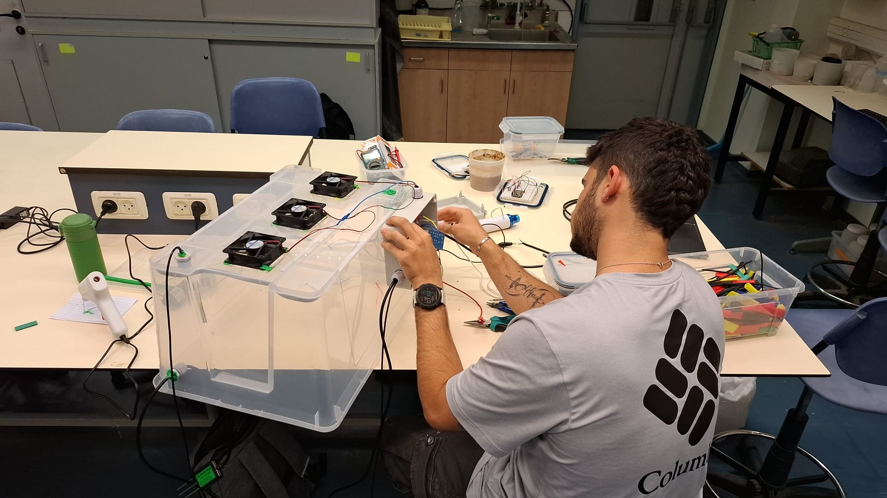

# The-Smart-MiniGreenhouse
**Authors: Oren Hasson, Daniel Nadav and Ziv Peleg**

We aimed to create a miniature greenhouse that could serve as a model for a larger one, designed to independently optimize internal conditions for specific plants (optimal conditions inserted by user). Our focus was on soil humidity, temperature, and light.

## Contents

- 📁 [Code](/Code/) This folder contains the scripts for operating the system.
- 📁 [Assets](/Assets/) This folder contains images that depict the mechanical components of the system.

## How the system works?
The system integrates a soil humidity sensor, a temperature sensor, and WiFi to optimize the greenhouse's operation.  

- 💧 Soil Humidity Sensor:
  The sensor is calibrated to 100% for a fully saturated soil benchmark. For a generic plant, 35% humidity is set as optimal. The sensor
  checks the soil every 20 seconds. If the humidity drops below 35%, irrigation activates for 20 seconds. Afterward, the sensor checks again
  and repeats the irrigation cycle as needed until optimal humidity is restored.
  The Soil Moisture Sensor is giving the command to activate or deactivate the irrigation to MQTT.
- 🌡️ Temperature Sensor:  
  Mounted on the greenhouse roof, the temperature sensor triggers a fan when the temperature reaches 30°C or higher.  
- ⛅ Lighting Control:  
  The system connects to WiFi to access real-time data and manage lighting. While primarily for convenience rather than plant health, the
  lights turn on at 17:00 (5 PM) and off at 23:00 (11 PM) daily.

## Components:
- Soil Moisture Sensor (Soil NPK RS485)
- Temperature Sensor DS18B20
- Fans- Computer Fans 12V
- FireBeetle 2 ESP32-e microcontroller
- Breadboard
- Relay Module: SRD-05VDC
- Outside Power sorce
- DC-DC Step Down Converter Board XL4015

## How it's made?
We used a Large Ikea plastic box to portarait the grenhouse. we drilled 3 square holes in the size of 3 fans that are activated according to temperature, as shown in the following image: 

In addition there was a hole drilled for the temperature and soil humidity sensors:

 

The wiring was made according to the following sketch:

The Soil Moisture Sensor we used is analog, and needed to be calibrated in a way that a saturated soil is 100% moisturer, and then ideal moister persentage need to be decided accordingly.

**Useful Links to Operate Sensors:**
- [Temperature Sensor DS18B20](https://randomnerdtutorials.com/guide-for-ds18b20-temperature-sensor-with-arduino/)
- [Soil Moisture Sensor](https://www.niubol.com/Agricultural-sensor/Soil-NPK-sensor.html)

We used the Step Down converter to convert voltage of 12V from the outside source to 5V (that is adequate for ESP32 and for the sensors used).

## Live Data From ThingSpeak
Our system is connected to ThingSpeak, which receives data every minute. You can monitor real-time changes in temperature and soil humidity as they respond to irrigation and fan operation, which activate or deactivate based on high temperature or low humidity.

The temperature data from ThingSpeak shows that during the sunnier hours of the day, when the temperature goes above 30°C, the fans are triggered and as they operate and the temp drops below 30°C, and that cycle repeats, until the shadier part of the day:

Similarly, the soil humidity data shows that when humidity drops below 35%, irrigation is activated, increasing the moisture level, and that cycle continues until the shadier part of the day:
 

## Suggestions For Recreating This Project
A few insights that we recomended to consider doing, and we would have done if we were to continue working on this project.

- Water Irrigation Control: We suggest to change the irrigation system in a way that the controller activates the irrigation as long as
  humidity is under 35% and to deactivate it once humidity is 35% or more (and not for 20 seconds each time). The reason we didnt do it that
  way was to prevent a case where if the soil humidity sensor breakes, the irrigation wont operate for long hours. In order to also achieve
  that goal, we suggest to limit irrigation for 1 hour or less.
  
- Backup for WiFi and MQTT: have a backup for irrigation and For the lights that will work in case that WiFi is down (hence the controller
  don't recieve the current hour) and if MQTT is down. For example, irrigation can be connected to a solenoid directly, and the lights could
  be operated by hours and not the accurate time, meaning 18 hours off and 6 hours on.
  
- SOLDERING
  

### For issues in recreating this project, please add your coments and prespective to our Issues Page.

## Expectations VS Reality
 

## Documentation of the Process
 
  

 

